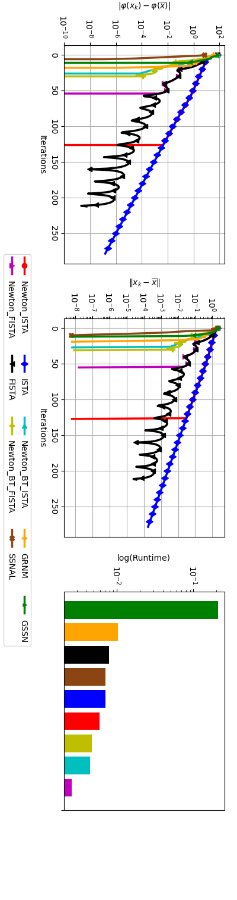
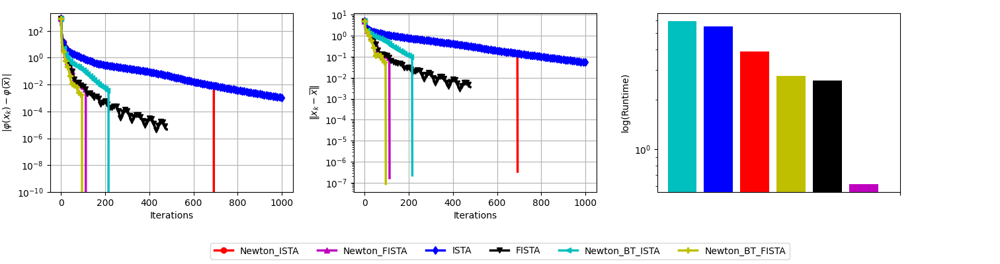
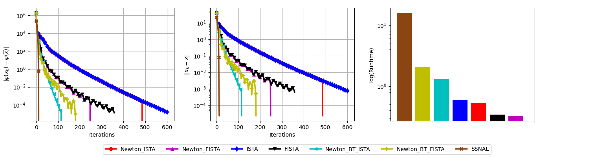
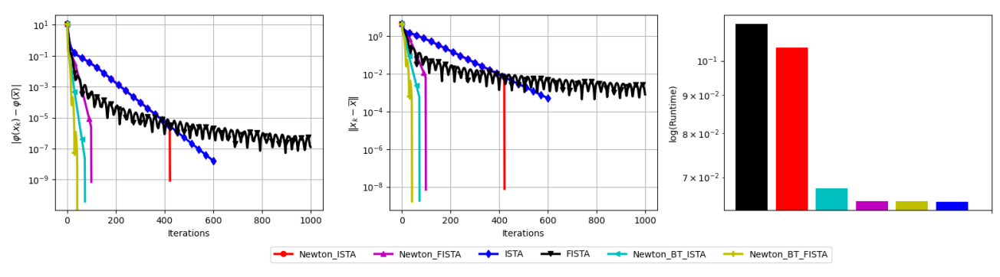

# Nonsmooth Newton Methods with Effective Subspaces for Polyhedral Regularization

This repository contains the experimental code for the paper
**"Nonsmooth Newton methods with effective subspaces for polyhedral
regularization"**.  The code implements and benchmarks hybrid first-order /
Newton methods for polyhedral regularized optimization problems, including
Lasso, generalized Lasso / TV-1D, infinity-norm regularization, group Lasso,
OSCAR, and related imaging examples.

Paper link: [https://arxiv.org/pdf/2511.16514](https://arxiv.org/pdf/2511.16514)

The central idea in the numerical experiments is to run a robust first-order
method at the beginning, identify an effective subspace, and then apply a damped Newton correction on that subspace.
The Newton step is protected by objective-decrease safeguards and, in the
Benchopt benchmarks, compared against standard solvers from the corresponding
benchmark suites.

## Repository Layout

- `src/lasso/`: Lasso utilities and algorithms, including ISTA/FISTA,
  Newton-ISTA/FISTA variants, backtracking variants, GSSN/BaGSS experiments,
  SSNAL-related code, and imaging demos.
- `src/Gen_lasso/`: generalized Lasso and TV-style Newton methods.  This
  includes the shared switching and damped Newton routines used by TV-1D
  benchmark wrappers.
- `src/ell_inf/`: infinity-norm regularized regression experiments.
- `src/OSCAR/`: OSCAR regularization solvers, utilities, Newton variants, and
  SSNAL/Newton-ALM comparison code.
- `src/Benchmarking_Free_FISTA/`: first-order method experiments and notebooks
  for composite optimization problems.
- `benchmarks/benchmark_lasso/`: Benchopt benchmark for dense Lasso with
  baseline solvers and custom Newton variants.
- `benchmarks/benchmark_oscar/`: Benchopt benchmark for OSCAR, using the
  OSCAR/SLOPE equivalence to compare against standard SLOPE solvers.
- `benchmarks/benchmark_tv_1d/`: Benchopt benchmark for TV-1D regression with
  analysis/synthesis baselines and custom Newton variants.
- `docs/`: notes about repository structure, workflows, and benchmark setup.

## Dependencies

The core scripts use:

- Python 3.11+
- `numpy`
- `scipy`
- `matplotlib`
- `scikit-learn`
- `pandas`
- `numba`

Several comparison solvers are optional:

- `benchopt==1.9.0` for the benchmark folders
- `cvxpy` for convex optimization reference solves
- `gurobipy` for Gurobi reference solves and some legacy subproblem solvers
- `celer` for Lasso / TV baseline solvers
- `skglm` for sparse generalized linear model baselines
- `sortedl1` for OSCAR/SLOPE baselines
- `modopt` for some FISTA baselines

The recommended Benchopt environment is provided in
`environment-benchopt.yml`:

```bash
conda env create -f environment-benchopt.yml
conda activate benchopt-lasso
```

Optional benchmark extras can then be installed as needed:

```bash
pip install cvxpy gurobipy modopt celer sortedl1 skglm
```

If `prox-tv` is unavailable, the TV-1D benchmark falls back to the local
Condat TV-1D proximal implementation.

## Running Benchopt Experiments

Run commands from the repository root.

Lasso benchmark:

```bash
benchopt run benchmarks/benchmark_lasso \
  -d "Simulated[n_samples=500,n_features=600,rho=0]" \
  -s Celer -s cd -s ista -s fista \
  -s newton_ista -s newton_fista \
  -s skglm -s sklearn
```

OSCAR benchmark:

```bash
benchopt run benchmarks/benchmark_oscar \
  -d "Simulated[n_samples=500,n_features=200,n_signals=20,X_density=1.0,rho=0.8]" \
  -o "OSCAR Regression[w1=1e-3,w2=1e-4,fit_intercept=False]" \
  -s ADMM -s PGD -s skglm -s sortedl1 -s Newt-ALM \
  -s newton_ista -s newton_fista -s newton_bt_ista -s newton_bt_fista
```

TV-1D benchmark:

```bash
benchopt run benchmarks/benchmark_tv_1d \
  -d "Simulated[n_samples=500,n_features=600,type_A=random,type_x=block,type_n=gaussian]" \
  -o "TV1D[data_fit=quad,delta=0,reg=0.5]" \
  -s "ADMM analysis" -s "Celer synthesis" -s "CondatVu analysis" \
  -s "Primal PGD analysis" -s "Primal PGD synthesis" -s "skglm synthesis" \
  -s newton_ista -s newton_fista
```

Benchopt writes interactive HTML and parquet outputs under each benchmark's
`outputs/` directory.

## Running Script-Based Experiments

Many original experiments are script-driven and can be run directly, for
example:

```bash
python src/lasso/comparison.py
python src/Gen_lasso/Gen_Lasso_run.py
python src/ell_inf/newton_infinity.py
python src/OSCAR/OSCAR_run.py
python src/Group_Lasso/comparison.py
```

Some scripts require optional solvers such as CVXPY or Gurobi, and some use
hard-coded problem sizes or data paths.  See `docs/PROJECT_FEATURES_AND_WORKFLOWS.md`
for a broader map of the repository.

## Representative Results

### Lasso



### Infinity-Norm Regularization



### OSCAR



### TV-1D



## Notes

- The benchmark wrappers live under `benchmarks/`, while the algorithmic source
  implementations live under `src/`.
- Benchopt uses cached runs by default.  Use `-f <solver_name>` to force a
  fresh run for a solver if timings look stale.
- Several directories contain exploratory or legacy scripts from the paper's
  development process; the Benchopt folders provide the most reproducible entry
  points for the final numerical comparisons.
